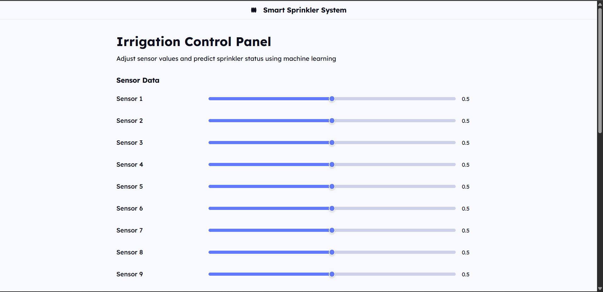
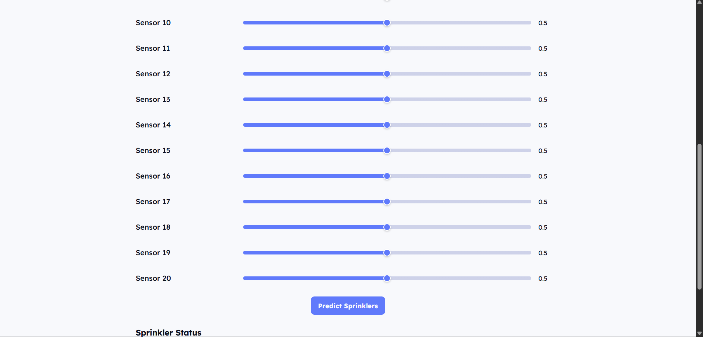
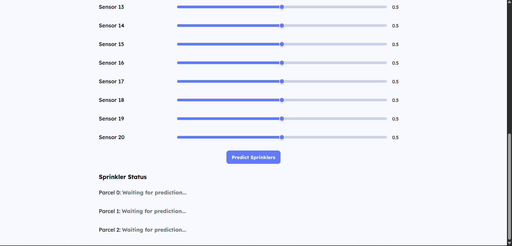
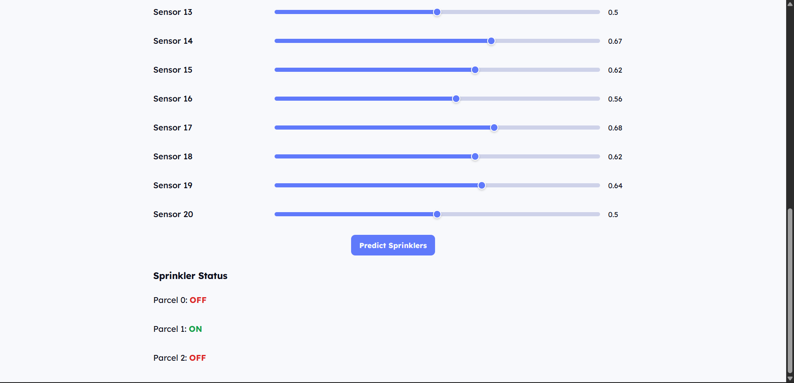
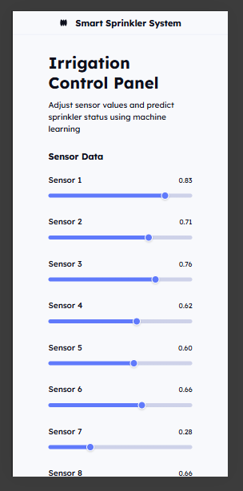
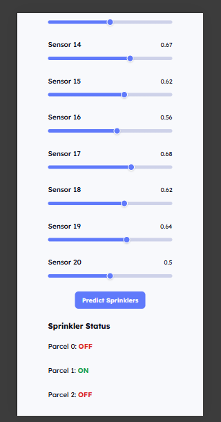

# Edunet-GreenSkills

A machine learning project for smart irrigation using sensor data to control pumps.

## Project Overview

This project implements a smart irrigation system using machine learning. It leverages sensor data to predict the optimal activation of three different irrigation parcels (pumps). The system includes a Jupyter Notebook for model development and a Flask web application for real-time predictions.

## Screenshots

### Web Application Screenshots





### Mobile View Screenshots




## Project Structure

- `greenskill.ipynb`: Main Jupyter notebook for data analysis, machine learning model training, and evaluation.
- `dataset.csv`: The dataset containing sensor readings and corresponding pump activation statuses.
- `README.md`: Comprehensive project documentation.
- `app.py`: Flask application that serves the web interface and handles prediction requests.
- `index.html`: Frontend HTML file for the web-based user interface.
- `requirements.txt`: Lists all Python dependencies required for the project.
- `Farm_Irrigation_System.pkl`: The trained machine learning model, saved using `joblib`.
- `screenshots/`: Directory containing various screenshots of the web and mobile applications.

## Getting Started

To set up and run this project locally, follow these steps:

1.  **Clone the repository:**
    ```bash
    git clone https://github.com/ashif57/Edunet-GreenSkills.git
    cd Edunet-GreenSkills
    ```

2.  **Install dependencies:**
    It is recommended to use a virtual environment.
    ```bash
    pip install -r requirements.txt
    ```

## Data and Preprocessing

-   **Dataset:** The `dataset.csv` file contains sensor data (`sensor_0` to `sensor_19`) and the corresponding states of three irrigation pumps (`parcel_0`, `parcel_1`, `parcel_2`).
-   **Preprocessing:**
    -   Unnecessary columns (e.g., `Unnamed: 0`) are removed.
    -   Features (`X`) are defined as `sensor_0` to `sensor_19`.
    -   Labels (`y`) are defined as the pump columns (`parcel_0`, `parcel_1`, `parcel_2`).
    -   **Feature Scaling:** Sensor data is scaled using `MinMaxScaler` to normalize values between 0 and 1, which helps improve model performance.

## Machine Learning Model

-   **Model Type:** A `RandomForestClassifier` is used, wrapped in a `MultiOutputClassifier` to handle the multi-label prediction task (predicting the state of three pumps simultaneously).
-   **Hyperparameter Tuning:** `RandomizedSearchCV` is employed to find the best hyperparameters for the `RandomForestClassifier`, optimizing `n_estimators`, `max_depth`, `min_samples_split`, `min_samples_leaf`, and `max_features`.
-   **Training:** The model is trained on the preprocessed and scaled sensor data.
-   **Evaluation:** Model performance is evaluated using a classification report, providing precision, recall, and F1-score for each pump.
-   **Model Persistence:** The trained model is saved as `Farm_Irrigation_System.pkl` using `joblib` for later use in the web application.

## Usage

### Jupyter Notebook (`greenskill.ipynb`)

1.  Open `greenskill.ipynb` in Jupyter Notebook or VS Code.
2.  Run all cells sequentially to perform data loading, preprocessing, model training, evaluation, and visualization.
3.  The notebook includes visualizations of pump activity based on the dataset.

### Web Application (`app.py`)

The Flask application provides a web interface to interact with the trained model.

1.  **Run the Flask application:**
    ```bash
    python app.py
    ```
    The server will start, typically accessible at `http://127.0.0.1:5000/`.

2.  **Access the Web Interface:**
    Open your web browser and navigate to `http://127.0.0.1:5000/`.

3.  **API Endpoint for Predictions:**
    -   **Endpoint:** `/predict`
    -   **Method:** `POST`
    -   **Request Body (JSON):**
        ```json
        {
          "sensor_values": [0.1, 0.2, 0.3, ..., 0.9, 1.0] // Array of 20 float values between 0.0 and 1.0
        }
        ```
    -   **Response Body (JSON):**
        ```json
        {
          "success": true,
          "predictions": {
            "parcel_0": "ON",
            "parcel_1": "OFF",
            "parcel_2": "ON"
          },
          "sensor_values": [...]
        }
        ```
    -   **Health Check:** A `/health` endpoint is available to check the server and model loading status.


## Future Enhancements

-   Further refine feature scaling and explore other normalization techniques.
-   Implement more advanced hyperparameter tuning strategies (e.g., GridSearchCV).
-   Add more interactive visualizations for feature importance and prediction results within the web application.
-   Explore deployment options for the web application (e.g., Heroku, AWS).
-   Integrate real-time sensor data input.
